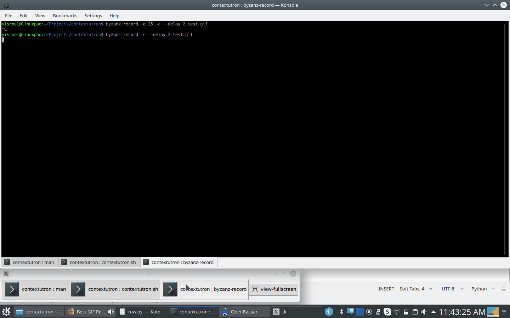

# Contextutron
A TouchBar for Linux

## Requirements
On Ubuntu, run both:

`sudo apt-get install xdotool python3-tk`

`pip3 install dbus-python cairosvg pyxdg`

## Running
run in the following way:

`./contextutron.sh -t <theme> [-s <icon size>] [-x]`

`-x` activates dock mode, in which there are no window decorations.

## Screenshots

### Konsole

