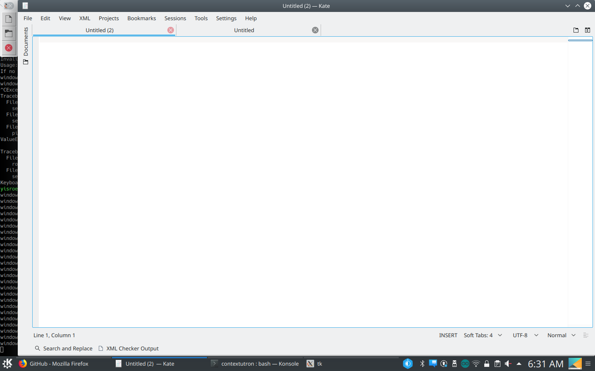

# Contextutron
A TouchBar for Linux

## Requirements
On Ubuntu, run both:
`sudo apt-get install xdotool python3-tk`

`pip3 install dbus-python cairosvg pyxdg`

## Running
enter the name of your theme.

`./swish.sh [theme]`

## Screenshots

### Kate

### Gedit

